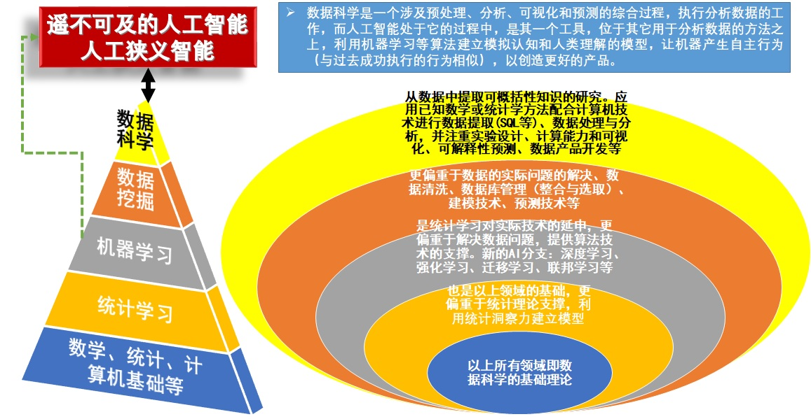
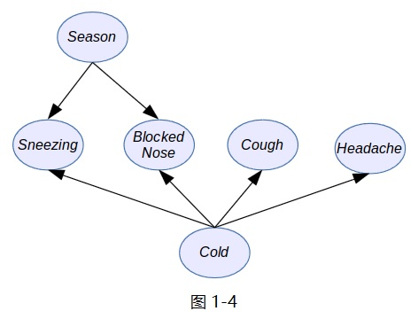
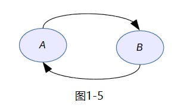
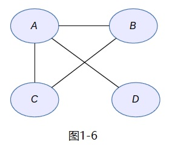
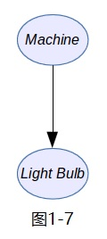
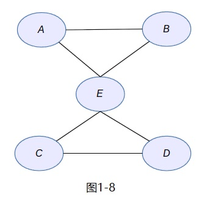
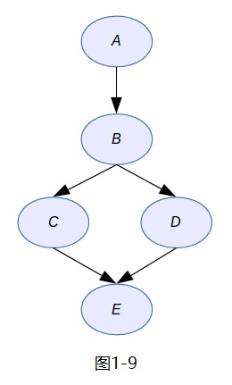

# 概率图模型(Probabilistic Graphical Models, PGMs)

- 很多任务需要人或自动系统去推理完成：利用合适的信息去获得结论，涉及真实世界中何谓真相又与如何行动相关，例如，医生需要了解患者的信息——症状、化验结果、个人特征——并对其可能患病和采用治疗方案做出结论

- 概率图模型结合了概率论与图论的知识，提供了一种简单的可视化概率模型的推理方法

- 学习使用PGMs，理解计算机如何通过贝叶斯模型和马尔可夫模型来解决真实世界的问题

- 选择合适的R包和算法处理数据并建模，属于数据科学范畴

- 

# 前  言

- PGMs是统计机器学习领域表示现实世界带有概率信息的数据和模型的最先进技术之一

- 使用贝叶斯方法来描述算法：概率和贝叶斯公式的基本原理

- 目的：从带有噪音和不确定性的真实世界中得出结论

- 推断和学习算法：自动从数据中构建模型（结构学习和参数参数）

- 关注解决数据科学问题的方法：贝叶斯分类模型、混合模型、贝叶斯线性回归以及用于构建复杂模型的基本模型

- 参考书目：David Bellot, 2016, Learning Probabilistic Graphical Models in R
            Daphne Koller, Nir Friedman, 2009, Probabilistic Graphical Models: Principles and Techniques

# 主要内容

- 第1章 概率推理：概率论和PGMs的基本概念及建模方法

- 第2章 精确推断：通过简单图形组合和模型查询（联结树精确推断算法）构建PGMs

- 第3章 学习参数：从数据集中使用最大似然法拟合和学习PGMs参数

- 第4章 贝叶斯建模：贝叶斯模型可作为更加复杂模型的基础模型、自适应算法拟合和查询贝叶斯模型

- 第5章 近似推断：PGMs的第二种推断方法，采样算法如MCMC（马尔科夫链蒙特卡洛）

- 第6章 贝叶斯建模：线性模型

- 第7章 概率混合模型：复杂的概率模型

- 网址：<http://www.packtpub.com>，注册登录后，再访问 <http://www.packtpub.com/support>，进行Code Downloads

# 第1章 概率推理

-  20世纪90年代中后期兴起数据挖掘，每天都在产生海量的数据 
    
-  连锁超市Wal-Mart数据库已累积10TB(1TB = 1000GB = $2^{40}$B = `r 2^40`B)级以上顾客购买行为和销售数据   
    
-  Google每天处理高达24PB(1PB = 1000TB = $2^{50}$B = `r 2^50`B), Twitter信息量的日发微博量达几亿条   
    
-  人类积累了大约超过500EB(1EB = 1000PB = $2^{60}$B = `r 2^60`B)以上的数据，大约500X10亿部压缩数字电影   
  
-  全世界数据量将达到3ZB(1ZB = 1000EB = $2^{70}$B = `r 2^70`B)以上，若全刻录在光盘，则光盘罗列高度是地球到月球距离5倍多

- 信息和大数据时代来临，存储数据不是获取知识，我们需要“挖矿”

  
  
- 统计学习（机器学习）或统计机器学习就是把数据转化为知识的最先进的技术之一，它是理解并挖掘数据的一个巨大的工具集

- 统计机器学习方法应用于大数据的分析就称为“数据挖掘”。(Alpaydin, E., 2009. Introduction to Machine Learning, Adaptive Computation and Machine Learning Series, seconded. The MIT Press,Cambridge, MA, USA.)
  
  * 
    + 通过数据挖掘应用，可从现有数据信息中检索、探索，同时从给定的数据信息库中去推断、预测并获得新的隐藏在数据背后的信息

- 21世纪最性感职业：数据科学家——采用科学方法、运用数据挖掘工具寻找新的数据洞察的工程师（更加全面的人才）

  
  
# 1.1 统计机器学习

- 统计机器学习的核心问题：推断问题或者说是如何使用数据和例子生成知识或预测

- 统计机器学习的两个基础问题：学习（从大量数据中抽取模式及算法设计）和推断（使用这些模式和算法）

- 统计机器学习是关于从数据和观察中学习和适应算法研究，并实现推理和借助学到的模型和算法来执行任务

- **概率图模型**是统计机器学习中一个最重要、最常用、最先进的技术之一，它使用图论中的边和点描述不同变量之间的关系，使用概率来处理数据的不确定性并表示关于事实和事件一定程度的信念或信度。用到最重要的数学知识就是表示或处理不确定性的概率和支持新老数据推理的贝叶斯推理（也称为拉普拉斯推理，Pierre-Simon Laplace, 1749-1827），事件信念会在新数据可用的时候得到更新和改进

- 真实世界本身是不确定的，即便是最简单的观察，例如天空的颜色也不可能绝对的确定。需要一套理论来解决这些不确定性，最自然的方法是概率论（PGMs的数学基础）；PGMs可以处理关于真实世界的不完整知识，因为我们的知识总是有限的，我们不能观察到所有的事情，不可能用一台计算机表示整个宇宙。与计算机相比，人类从根本上是受限，PGMs可以构建简单的学习算法或复杂的专家系统，有了新数据可改进或优化这些模型，并可对未知的局势和事件做出推断或预测

- 当数据量非常大时，即便最简单的概率问题也很棘手，需要一套框架支持面向真实世界问题复杂度的模型和算法的便捷开发，比如理解人类语言、开车、股票交易、识别画中人脸或完成医疗诊断等；这种框架具有很好的算法可重复性

- 此框架为PGMs，旨在区分模型设计任务和算法实现任务。因为它基于概率论和图论，拥有坚实的数学基础，而且它是许多标准和经典模型的数学泛化，并允许复用、混合和修改这些模型

- 数学、统计学、计算机基础等，统计学习，机器学习，数据挖掘，数据科学与人工智能的关系

  
  
# 1.2 使用概率表示不确定性

- PGMs是一种表示几个变量的联合概率分布的方法

- PGMs是一种表示几个变量共同出现的数值信念的工具

- PGMs直观上很简单，但强调的是对于许多（几百个、几千个到几百万个）变量概率分布的表示

- 本节研究问题：

  * 
    + __为什么概率是表示人们对于事实和事件信念的优良工具__
  
  * 
    + __概率积分的基本概念__
  
  * 
    + __贝叶斯模型的基础构建模块__
  
  * 
    + __贝叶斯推断：从先前信念和新数据中计算新的事实和结论的前言技术__
  
# 1.2.1 信念和不确定性的概率表示

- 概率是一种量化常识推理和信念程度的工具，在机器学习背景下，信念已被扩展到计算机上

- 借助算法，计算机会通过概率表示确定的事实和事件的信念（确定的事件但有不确定性的发生结果）

- 例子：掷硬币游戏；硬币正面或者反面向上的概率或机会是多少？$50\%$的机会或$0.5$的概率

  * 
    + __频率派解释__：通过观察抛掷多次，长期来看一半次数正面向上，另一半次数反面向上，即用数值（$0\sim1$或者$0\%\sim100\%$）$0.5$或$50\%$来量化；只在试验可重复非常多的次数时才有效
  
  * 
    + __贝叶斯派解释__：把因素或事件的不确定性通过指认数值（$0\sim1$或者$0\%\sim100%$）来量化（主观置信度或信度即信念）；比如抛掷一枚硬币之前会给每个面指定$50\%$的向上机会；观看$10$匹马的赛马，对马匹和骑手一无所知，故给每匹马指定$0.1$或$10\%$赢的概率
  
  * 
    + 两者区别在于是否能**重复多次或上千次或任意次**试验；抛掷硬币可以、赛马不可以，但如果你相信赛马团队是最厉害的，你会指定一个$0.9$的概率来确信团队拿下下次比赛
  
  * 
    + 但贝叶斯思想的主要优势就是**不需长期频率或同一试验的重复**，可不断更新数据或信息改善信念
  
  * 
    + 两学派界限不清，但概率计算规则是完全相同的

# 1.2.2 条件概率

- 概率图模型几乎全都是条件概率的思想

- 对马匹（$10$匹马）和骑手一无所知，每匹马赢指定$0.1$或$10\%$赢的概率；但若知道国家最好的骑手参加了这项赛事，则这个骑手获胜的概率可能就是$19\%$，而其它骑手获胜的概率只有$9\%$

- **条件概率**：基于已知其他事件的结果，得到当前事件的概率；完美地解释改变直觉认识或者（更技术性描述）给定新的信息来更新信念

# 1.2.3 概率计算和随机变量
## 样本空间，事件和概率

- **样本空间**$\Omega$：一个试验所有可能输出的集合，称$\Omega$的一个点$\omega$为一个**实现**；
  
- 称$\Omega$的一个子集为一个**事件**；例如，抛掷一枚硬币一次，$\Omega=\left\{正面(H),反面(T)\right\}$，$\left\{H\right\}$或$\left\{T\right\}$是一个事件；抛掷一枚硬币两次，$\Omega=\left\{HH,HT,TH,TT\right\}$，一个事件可为$\left\{首先出现正面\right\}$，即$E=\left\{HH,HT\right\}$；连续型数值空间和事件
  
- **概率**：把每一个事件映射到一个实数$P(E)$，满足3个公理：非负$P(E)\ge0$、归一$P(\Omega)=1$、独立$P(\bigcup_{i=1}^{\infty}E_i)=\Sigma_{i=1}^{\infty}P(E_i)$

# 1.2.3 概率计算和随机变量  
## 随机变量和概率计算

- **随机变量**：从样本空间到实数的函数映射；在特定试验中，随机变量如下：
  
  * 
    + 试验$1$：当投掷一枚硬币$N$次时，正面向上的次数$X$是一个随机变量
    
  * 
    + 试验$2$：当投掷两颗骰子时，两个点数之和$X$是一个随机变量
    
- **概率分布**：随机变量的每个取值对应每一个可能的事件，且关联一个概率$P_i$，所有这些概率的集合是随机变量的**概率分布**
  
  * 
    + 考虑投掷一枚硬币3次的试验：样本空间中的样本点是3次投掷结果（比如$HHT$）；列举出样本空间为$$S=\left\{HHH,HHT,HTH,THH,TTH,THT,HTT,TTT\right\}$$
    
  * 
    + 设定随机变量$X$为正面向上的总次数，它把样本空间映射到下表所示的数值：
    
  * 
    + 表$1-1$
    
      $s$   | HHH  | HHT  | HTH  | THH  | TTH  | THT  | HTT  | TTT
      ----  | ---- | ---- | ---- | ---- | ---- | ---- | ---- | ----
      $X(s)$|  3   |  2   |  2   |  2   |  1   |  1   |  1   |  0

  * 
    + 随机变量$X$的取值范围是$\left\{0,1,2,3\right\}$，假设所有样本点都有相同的概率$1/8$，则可推出$X$取值的概率分布
    
  * 
    + 表$1-2$
    
      $x$     |  0    |  1    |  2    |  3   
      ----    | ----  | ----  | ----  | ----
      $P(X=x)$|$1/8$  | $3/8$ | $3/8$ | $1/8$

  * 
    + 考虑投掷一枚硬币3次的试验：样本空间中的样本点是3次投掷结果（比如$HHT$）；列举出样本空间为$$S=\left\{HHH,HHT,HTH,THH,TTH,THT,HTT,TTT\right\}$$
    
  * 
    + 设定随机变量$X$为第$i$次投掷是否正面向上，它把样本空间映射到下表所示的数值：
    
  * 
    + 表$1-3$：第$1$次投掷是否正面向上的随机变量（同理可给出第$2$次投掷和第$3$次投掷是否正面向上）
    
      $s$   | HHH  | HHT  | HTH  | THH  | TTH  | THT  | HTT  | TTT
      ----  | ---- | ---- | ---- | ---- | ---- | ---- | ---- | ----
      $X(s)$|  1   |  1   |  1   |  0   |  0   |  0   |  1   |  0

  * 
    + 随机变量$X$的取值范围是$\left\{0,1\right\}$，假设所有样本点都有相同的概率$1/8$，则可推出$X$取值的概率分布
    
  * 
    + 表$1-4$：$P(X=1)$对应了第1次投掷正面向上的事件$H_1$（同理可对应$H_2$和$H_3$）
    
      $x$     |  0    |  1    
      ----    | ----  | ----
      $P(X=x)$| $1/2$ | $1/2$
    
  * 
    + 由此可得到$$H_1=H_2=H_3=1/2$$  $$P(H_1 \bigcap H_2 \bigcap H_3)=P(\left\{HHH\right\})=1/8=1/2 \cdot 1/2 \cdot 1/2=P(H_1)P(H_2)P(H_3)$$  $$P(H_1 \bigcap H_2)=P(H_1)P(H_2)$$  $$P(H_1 \bigcap H_3)=P(H_1)P(H_3)$$  $$P(H_2 \bigcap H_3)=P(H_2)P(H_3)$$，即事件$H_1$、$H_2$、$H_3$是相互独立的

# 1.2.4 联合概率分布
  
- 同时考虑试验$1$和试验$2$的情况，如果关注$\left\{投掷硬币2次正面向上且投掷两颗骰子点数之和6点\right\}$的低概率事件

  * 
    + 设定随机变量$X$为投掷硬币$2$次后获得正面的次数，取值$\left\{0,1,2\right\}$；设定随机变量$Y$为投掷两颗骰子后获得的点数之和，取值$\left\{2,3,4,?\right\}$
    
  * 
    + 两个随机变量的取值分别对应自己的概率分布，但有时我们对$\left\{X=2,Y=6\right\}$感兴趣，所有$X,Y$取值组合的概率集合也对应一个概率分布$P(X,Y)$，称为**联合概率分布**
    
- 一个PGMs就是一个联合概率分布，真实世界可由一个很长很复杂的联合概率分布
    
- 联合概率的**边缘化或边际化**：考虑几个随机变量的联合概率分布时，消除一些变量而得到较少变量的（联合）概率分布
  
  * 
    + 联合概率分布$P(X,Y)$的边缘分布$P(X)$可以通过下面操作获得$$P(X)=\sum_{y}P(X,Y)$$
  
  * 
    + 按照$y$所有可能的取值汇总概率，即可从$P(X,Y)$消除$Y$；考虑一下两个不相干事件或相互独立随机变量的概率与这个边缘化概率的关系？
  
  * 
    + 当$Y$是连续变量时，边缘化可写成$$P(X)=\int_{y}P(X,y)dy$$
  
  * 
    + 对于概率图模型是很难计算边缘化概率的，研究PGMs几乎都试图提出有效算法解决此问题，目前已有很多算法可处理真实世界中包含许多变量的复杂而有效的模型

# 1.2.5 贝叶斯规则

- 当一个模型（比如PGMs）很复杂时，通常希望从一个或少数变量中抽取信息或预测结果，此时就会用上边缘化概念

- 但最重要的两个概念是条件概率和贝叶斯规则

- **条件概率**：指在知道其他事件发生的条件下当前事件的概率；两个事件必须具有某种程度的依赖，且各自的条件概率关系可相互转换

  * 
    + 明天下雨的概率是多少？明天路上拥堵的概率是多少？
  
  * 
    + 知道明天下雨的话，路上拥堵的概率又是多少？它应该比没有下雨信息的情况下要高
  
  * 
    + 形式化的公式如下：$$P(X|Y)=\frac{P(X,Y)}{P(Y)}和P(Y|X)=\frac{P(X,Y)}{P(X)}$$
  
  * 
    + 由上面两个公式中可推导出**贝叶斯公式**（拉普拉斯公式）：$$P(X|Y)=\frac{P(Y|X) \cdot P(X)}{P(Y)}$$
  
      + 公式中把$P(X|Y)$叫作是给定$Y$条件下$X$的**后验分布**；把$P(X)$叫作**先验分布**；把$P(Y|X)$叫作**似然率**（似然度）；把$P(Y)$叫作**归一化因子**（正规化因子）
    
      + **归一化因子**：根据$P(X,Y)=P(Y|X)P(X)$，则有$P(Y)=\sum_xP(X,Y)=\sum_xP(Y|X)P(X)$，即在消除（移出）联合概率分布中单个变量的边缘化
    
      + 借助简单的代数技巧，贝叶斯公式可改写成一般的且最方便使用的形式：$$P(X|Y)=\frac{P(Y|X) \cdot P(X)}{\sum_xP(Y|X)P(X)}$$
    
      + 以上公式之美在于只需给定和使用$P(X)$和$P(Y|X)$，即**先验分布**和**似然率**；但分母中的求和是个很棘手的问题，需要先进的技术对应复杂的问题或模型
   
# 1.2.5 贝叶斯规则
## 解释并理解贝叶斯公式

- 把贝叶斯公式中随机变量$X$和$Y$改写成另外两个变量的形式（用什么字母并不重要）：$$P(\theta|D)=\frac{P(D|\theta) \cdot P(\theta)}{\sum_{\theta}P(D|\theta)P(\theta)}$$

  * 
    + 以上公式中的条件概率及其它概率可以给出公式背后的自然理解
  
  * 
    + __先验分布__$P(\theta)$：指在知道其它信息之前对$\theta$的认识——初始信念

  * 
    + 给定$\theta$值下的**似然率**$P(D|\theta)$：指可以生成什么样的数据$D$，即对于所有的$\theta$，产生数据$D$的概率是多少？

  * 
    + __后验概率__$P(\theta|D)$：指观察到$D$之后，对$\theta$的新信念；此贝叶斯公式可在收到新的信息后一次又一次计算$\theta$新的分布
  
# 1.2.5 贝叶斯规则
## 贝叶斯规则的第一个例子

- 介绍第一个R语言的贝叶斯程序

- 定义**离散随机变量**：指只能取预定义数量即有限个数值的随机变量，比如制作灯泡的机器是正常工作还是出现故障？

- 确定第一个随机变量$M=\left\{working, broken\right\}$，表示制作灯泡的机器工作状态

  * 
    + 通常灯泡数量很多，不太可能测试每一个灯泡，故设计一个试验，抽取机器制作的一批灯泡样本，利用贝叶斯规则估计机器是否在正常工作？
  
  * 
    + 编写R函数构建贝叶斯模型，需确定两个元素：**先验分布**和**似然率**

  * 
    + 给出机器工作状态变量$M$的**先验分布**，即关于机器工作状态的初始信念，假设相信机器是可以正常工作的，故其先验分布如下：$$P(M=working)=0.99$$ $$P(M=broken)=0.01$$
  
  * 
    + 为了使用概率的贝叶斯思想，假设只有一台机器，对机器正常工作的信念度很高，即机器$99\%$正常工作和$1\%$出现故障
  
  * 
    + 如果使用概率的频率派解释，则可询问机器供应商，得到生产正常的机器的频率信息

- 确定第二个变量$L=\left\{good, bad\right\}$，表示机器生产的灯泡状态
  
  * 
    + 给出灯泡状态变量$L$的**似然率**：$P(L|M)$；此例子因为$L$受到$M$的影响，不需要给出先验分布$P(L)$
  
  * 
    + 但此时需要定义两个概率分布：一个是当机器正常工作时灯泡状态变量的概率分布；一个是当机器出现故障时灯泡状态变量的概率分布，即
  
      + 当$M=working$时，生产出好的灯泡或者坏的灯泡的可能性是多少？
    
      + 当$M=broken$时，生产出好的灯泡或者坏的灯泡的可能性是多少？
    
  * 
    + 不管是贝叶斯派还是频率派，都可给出最可能的概率统计：$$P(L=good|M=working)=0.99$$ $$P(L=bad|M=working)=0.01$$ $$P(L=good|M=broken)=0.60$$ $$P(L=bad|M=broken)=0.40$$
  
      + 即如果机器正常工作，生产$100$个灯泡只会有一个是坏的；如果机器出现故障，则认为至少$40\%$的灯泡都是坏的
  
  * 
    + 这就刻画了第一个贝叶斯模型的例子，假如想知道在已知观察的最后一个灯泡是坏的情况下，机器是否正常工作？故可计算**后验概率**$P(M|L)$（通常称为“概率查询问题”）
  
      + 即$L=bad$，使用贝叶斯公式有：$$P(M=working|L=bad)=\frac{P(L=bad|M=working) \cdot P(M=working)}{\sum_MP(L=bad|M) \cdot P(M)}$$ $$=\frac{P(L=bad|M=working) \cdot P(M=working)}{P(L=bad|M=working) \cdot P(M=working)+P(L=bad|M=broken) \cdot P(M=broken)}$$$$=\frac{0.01 \times 0.99}{0.01 \times 0.99+0.40 \times 0.01}=0.71$$
    
      + 即机器正常工作的概率是$71\%$，这个值比较低，但符合机器正常的直观感觉；尽管观察到一个灯泡坏了，但也仅此一个，也许下一个就好了
    
      + 设定机器工作状态变量$M$具有相等的**先验**概率：$50\%$的机会是机器正常工作，$50\%$的机会是机器出现故障，则重新计算$P(M|L)$得$$\frac{0.01 \times 0.50}{0.01 \times 0.50+0.40 \times 0.50}=0.024$$
    
      + 表明机器只有$2.4\%$的概率正常工作，即在没有做出有关机器正常的任何强假设下，生产出一个坏灯泡就可看出机器问题的迹象

# 1.2.5 贝叶斯规则
## 贝叶斯规则的第一个R语言例子

- 如果观察到多个坏灯泡，则需要怎么办？只看到一个坏灯泡就说机器出现故障需要维修，这似乎有些不合情理

- 贝叶斯派的做法是使用**后验概率**作为新的**先验概率**，并依次（按顺序）更新后验分布，编写如下R语言程序的贝叶斯函数

- 给定三个参数：先验分布($prior$)、似然率($likelihood$)和观察到的数据序列($data$)

- 下面的R代码是一个可计算给定**先验分布**、**似然率**和**观察数据序列**后的**后验概率**的函数

    ```{r the first Bayesmodel, echo=TRUE, tidy=TRUE, warning=FALSE, message=FALSE, comment=""}
    prior <- c(working = 0.99, broken = 0.01)
    likelihood <- rbind(
      working = c(good = 0.99, bad = 0.01),
      broken = c(good = 0.60, bad = 0.40)
    )##表示一个矩阵（二维）和数组（多维）
    data <- c("bad", "bad", "bad", "bad")
    ```
    
- 即以上代码定义了$3$个变量，包含机器工作状态变量$M$的先验分布($prior$)，刻画机器每个状态下灯泡状态变量$L$的似然率($likelihood$)，即有4个值
    ```{r likelihood1, echo=TRUE, tidy=TRUE, warning=FALSE, message=FALSE, comment=""}
    likelihood
    ```

- 计算观察到一个灯泡是坏的情况下的**后验概率**$P(M|L)$

    ```{r likelihood2, echo=TRUE, tidy=TRUE, warning=FALSE, message=FALSE, comment=""}
    posterior <- prior*likelihood[, data[1]]/sum(prior*likelihood[, data[1]])
    posterior
    ```
   
- 由于变量$data$包含了观察到的、用于测试机器和计算后验概率的灯泡状态序列，故定义如下贝叶斯更新函数：

    ```{r bayesfunction, echo=TRUE, tidy=TRUE, warning=FALSE, message=FALSE, comment=""}
    bayes <- function(prior, likelihood, data)
    {
    	posterior <- matrix(0, nrow=length(data), ncol=length(prior))
    	dimnames(posterior) <- list(data, names(prior))
    
    	initial_prior = prior
    	for(i in 1:length(data))
    	{
    		posterior[i, ] <- 
    			prior*likelihood[ , data[i]]/
    			sum(prior * likelihood[ , data[i]])
    
    		prior <- posterior[i , ]
    	}
    
    	return(rbind(initial_prior, posterior))
    }
    ```
    
  * 
    + 创建一个矩阵，存储后验分布连续计算的结果
  
  * 
    + 对于每个数据，给定当前先验概率计算后验概率：贝叶斯公式的R代码
  
  * 
    + 新的先验概率就是当前的后验概率，且不断迭代同样的过程
  
- 函数返回一个矩阵，包含初始先验概率和所有后续计算的后验概率：

    ```{r bayesexample, echo=TRUE, tidy=TRUE, warning=FALSE, message=FALSE, comment=""}
    bayesexample <- bayes(prior, likelihood, data)
    bayesexample##矩阵或数组
    ```

- 使用R函数绘制两个后验分布的演化过程：一个是机器正常工作的后验概率；一个是机器出现故障的后验概率

    ```{r bayesplot, echo=TRUE, tidy=TRUE, warning=FALSE, message=FALSE, comment=""}
    matplot(bayesexample, type = 'b', lty =c(1, 2), lwd = 2, pch =c(15, 16), col =c(2, 3), xlab = "观察数据序列", ylab = "后验概率")
    legend(3.5, 0.6, c("正常工作概率", "出现故障概率"), col = c(2, 3),
       text.col = "green4", lty = c(1, 2), pch =c(15, 16), merge = TRUE, bg = "gray90")
    ```
    
  * 
    + 随着坏灯泡的增多，机器正常工作的概率快速下降（实线和绿色线）；机器出现故障的概率快速上升（虚线和红色线）
    
  * 
    + 原本假设$100$只灯泡中只有$1$个坏灯泡（即不要有太多坏灯泡），机器正常工作的概率还挺高（$71\%$），但随着观察到越来越多的坏灯泡，则不断更新了机器正常工作的后验概率，故这个机器现在需要维修了
    
- 不同的**先验概率**$P(M)$，会有不同的变化过程；假设没有关于机器是否正常工作的信息，即认为两种情况具有相同的概率：

    ```{r bayesplot1, echo=TRUE, tidy=TRUE, warning=FALSE, message=FALSE, comment=""}
    prior1 <- c(working = 0.50, broken = 0.50)
    bayesexample1 <- bayes(prior1, likelihood, data)
    matplot(bayesexample1, type = 'b', lty =c(1, 2), lwd = 2, pch =c(15, 16), col =c(2, 3), xlab = "观察数据序列", ylab = "后验概率")
    legend(3.5, 0.6, c("正常工作概率", "出现故障概率"), col = c(2, 3),
       text.col = "green4", lty = c(1, 2), pch =c(15, 16), merge = TRUE, bg = "gray90")
    ```
    
  * 
    + 得到了一个快速收敛的曲线，其中机器出现故障的概率很高，对观察到的一批坏灯泡来说，并不意外
    
- 若还是假定机器正常工作的概率为$99\%$，但如果变换观察到的灯泡数据：

    ```{r bayesplot2, echo=TRUE, tidy=TRUE, warning=FALSE, message=FALSE, comment=""}
    prior <- c(working = 0.99, broken = 0.01)
    data2 <- c("bad", "good", "good", "good", "good", "good", "good", "good", "good", "good")
    bayesexample2 <- bayes(prior, likelihood, data2)
    matplot(bayesexample2, type = 'b', lty =c(1, 2), lwd = 2, pch =c(15, 16), col =c(2, 3), xlab = "观察数据序列", ylab = "后验概率")
    legend(8, 0.6, c("正常工作概率", "出现故障概率"), col = c(2, 3),
       text.col = "green4", lty = c(1, 2), pch =c(15, 16), merge = TRUE, bg = "gray90")
    ```
    
  * 
    + 贝叶斯算法在观察到的第一个坏灯泡时有点犹豫，即机器正常工作的概率下降，但后来它又收敛到很高的概率
    
# 1.3 概率图模型

- 接下来介绍如何创建带有多于两个随机变量真实世界的模型，以及如何解决两个重要问题：

  * 
    + __推断问题__：观察到新数据时计算后验概率的问题
  
  * 
    + __学习问题__：数据集中先验概率的确定问题
  
- 上一节介绍的简单贝叶斯算法可以解决推断问题，但只考虑了两个离散随机变量，过于简单而无法捕捉真实世界的复杂性

- 概率图模型作为一种通用框架从简单的结构模块生成并使用复杂的概率模型；**复杂**是指为了表示和解决拥有大量变量（构成结构模块的变量）或数据的任务，而复杂的模型可分解成几个相互交互的简单结构，最简单的结构就是一个随机变量

# 1.3.1 概率模型

- 当考虑多个随机变量时，通过联合概率分布可表示复杂变量结构，但如果变量是几百、几千甚至更多的，表示这么庞大的分布是很难的

- 例如，医学诊断中，每个变量表示一个症状，其他变量可表示病人的年龄、性别、体温、血压等，或者最近的天气条件和饮食状况

- 从此复杂的系统或模型结构中，需解决两个问题：

  * 
    + 从病人的数据库中，评估和发现所有的概率分布以及相关参数（学习问题）
  
  * 
    + 把问题放入模型中，例如，如果观察到了一系列症状，问病人是否还健康？又如，如果改变病人的饮食，并开了这个药，问病人是否会恢复？（推断问题）
  
- 有一点很重要：在概率图模型中，可利用其它重要的结构知识即不同随机变量之间的依赖关系（或条件独立性）；例如，症状和疾病之间有明显的依赖关系；又如，饮食和症状之间的依赖关系不太明显，或者通过其它变量比如年龄、性别有所依赖（条件独立）
  
- 概率图模型中的推理具有概率性质，对任意变量的观察可推出其它变量的后验分布，得到它们的概率具有比二元响应更丰富的回答

# 1.3.2 图和条件独立

- 假设有$2$个二元随机变量$X$和$Y$，其联合概率分布为$P(X,Y)$，两个变量分别取值为$x_1$、$x_2$和$y_1$、$y_2$

- 分别对应于$2^2=4$个概率值，即$P(x_1, y_1)$、$P(x_1, y_2)$、$P(x_2, y_1)$、$P(x_2, y_2)$

- 假设有$10$个二元随机变量$X_1, X_2, \cdots, X_{10}$，则需要提供$2^{10}=1024$个概率值来确定它们的联合概率分布

- 假设有$20$个二元随机变量，则需要给定$2^{20}=1048576$个概率值（呈指数级增长），这个相对简单的模型几乎已无法建模

- 概率图模型正是简洁地描述这类模型的框架，利用条件独立性（结构知识）支持有效的模型构建和使用，即用图表示变量之间的结构知识

- 例如，医学如何诊断感冒？（此示例做了极大的简化，不代表任何医学建议）

  * 
    + $Season (Se)$：年内季节；$Blocked Nose (N)$：鼻子堵塞；$Headache (H)$：病人头痛；$Sneezing (S)$：病人经常打喷嚏；$Cough (C)$：病人咳嗽；$Cold$：病人感冒
  
  * 
    + 每个症状都可用随机变量来表示不同程度的取值，例如，病人鼻子有点堵塞，则给定$P(N=blocked)=0.60$和$P(N=notblocked)=0.40$
  
  * 
    + 联合概率分布$P(Se,N,H,S,C,Cold)$一共需要$4 \times 2^5=128$个概率值（季节$4$个取值，症状$2$个取值）
  
  * 
    + 很难确定推断和学习问题，比如，鼻子不堵塞的概率、病人头痛和打喷嚏等的概率
  
  * 
    + 但可以确定头痛与咳嗽或鼻子堵塞没有直接关系，除非病人感冒了；而且**季节**对**打喷嚏**、**鼻子堵塞**有非常直接的影响，或者**咳嗽**对于**头痛**有很少或几乎没有影响；在概率图模型中，可用图表示这些依赖关系，见下图$1-4$
  
      
    
      + 图中节点代表随机变量，节点间箭头代表随机变量之间的依赖关系，由此可简化联合概率分布

- 使用图作为模型来简化复杂（或甚至混乱）分布的优势：

  * 
    + 在真实世界问题的建模中，通常随机变量只与其他随机变量的小规模子集直接交互（六度分隔理论、六度空间理论以及小世界理论等），故使用图可使模型更加紧凑和易于处理
  
  * 
    + 图中的结构知识和依赖关系易于理解和沟通
  
  * 
    + 图模型引出了联合概率分布的紧凑表示，并且易于计算
  
  * 
    + 使用图论和相关算法可实现推断和学习算法：与初始的联合概率分布相比，使用概率图模型会以几个级数的速度加速计算
  
# 1.3.3 分解分布

- 医学诊断感冒的概率图模型中的结构知识即独立假设，可从数据集中发现这些假设即结构学习，则它们的联合概率分布可分解为因子的乘积：$$P(Se, N, H, S, C, Cold)$$ $$=P(Se)P(S|Se, Cold)P(N|Se, Cold)P(Cold)P(C|Cold)P(H|Cold)$$

- 因子是更加简单的概率分布，比如$P(C|Cold)$表示病人感冒的情况下咳嗽的概率；此时每个因子（分布）只需要确定少量的参数：$4+2^3+2^3+2+2^2+2^2=30$，远少于$128$个参数

- 参数很容易通过人工信度或观察数据确定；例如，不知道病人是否感冒，故给定$P(Cold=true)=P(Cold=false)=0.50$；又如，如果病人得了感冒（$Cold=true$），他很有可能咳嗽；如果$Cold=false$，病人咳嗽的概率很低，但不会为0，因为可能还有其它导致咳嗽的原因

# 1.3.4 有向概率图模型

- 按如下形式分解多个随机变量$X_1, X_2, \cdots, X_n$上的联合概率分布：$$P(X_1, X_2, \cdots, X_n)=\prod_{i=1}^{n}P(X_i|pa(X_i))$$

  * 
    + $pa(X_i)$是图中定义的变量$X_i$的父节点的子集
  
  * 
    + 图$1-5$的父节点很容易理解：当箭头$A$指向$B$时，$A$就是$B$的父节点，反之亦是
  
      
    
  * 
    + 有向概率图模型很适合构建需要表示因果关系的问题，也适合参数学习即每个局部概率分布很容易学习
  
  * 
    + 但图必须是无环的，即图$1-5$中不应该有从$A$到$B$和从$B$指向$A$的箭头
  
# 1.3.5 无向概率图模型

- 无向概率图模型也称为马尔可夫网络，按如下形式分解多个随机变量$X_1, X_2, \cdots, X_n$上的联合概率分布：$$P(X_1, X_2, \cdots, X_n)=\frac{1}{Z}\prod_{c=1}^{C}\varphi_c(X_c)$$

  * 
    + 左边第一项是通常的联合概率分布
  
  * 
    + 常数$Z$是归一化常数，确保右侧所有项的和为1，因为这是一个概率分布
  
  * 
    + $\varphi_c$是变量子集$X_c$上的因子，以便这个子集的每个变量组成一个极大团，即内部所有节点都相互连接的子图，如图$1-6$所示
  
      
    
      + 上图中有$4$个节点，且$\varphi_c$定义在子集即极大团$A,B,C$和$A,D$上，因此此处概率分布也不复杂
    
      + 此类概率图模型在计算机视觉、图像处理等遵循一定模式的领域应用广泛
    
# 1.3.6 实例与应用

- 灯泡机器的概率图模型分解形式如下：$P(L, M)=P(M) \cdot P(L|M)$

- 感冒诊断的概率图模型分解形式如下：$P(Se, N, H, C, Cold)=P(Se)P(S|Se, Cold)P(N|Se, Cold)P(Cold)P(C|Cold)P(H|Cold)$

          
  
- 使用 R Packages **gRain**(需加载程序包**gRbase**)表示概率图模型，实际这个程序包还依赖于许多其他的程序包，而且提供了对图模型的一些基本操作函数

- 先介绍一下R语言的重要工程项目：**Bioconductor**，它是促进当前和新兴的高通量生物组数据（DNA microarray，sequence，flow，SNP和其它数据）的统计分析和理解的工具，主要是基于R语言编写了其中大多数的软件包，致力于开源、协作、分布式软件开发和读写、可重复的研究。
    ```{r Construct PGMs, echo=TRUE, tidy=TRUE, warning=FALSE, message=FALSE, comment=""}
    library(BiocManager)
    #if (!requireNamespace("BiocManager", quietly = TRUE))
    #install.packages("BiocManager")
    #BiocManager::install(version = "3.12")
    #source("http://bioconductor.org/biocLite.R")##如果R版本<3.5.0，有些特殊的程序包需要调用此函数，比如“GenomicFeatures”和“AnnotationDbi”, BiocInstaller::biocLite(c("GenomicFeatures", "AnnotationDbi"))
    #biocLite()
    #install.packages("gRain")
    library("gRain")
    ```

- 定义一个无向图（随机变量$A,B,C,D,E$）：
    ```{r simple undericted graph, echo=TRUE, tidy=TRUE, warning=FALSE, message=FALSE, comment=""}
    graph <- gRbase::ug(~ A:B:E + C:E:D)
    class(graph)
    ```
    
  * 
    + 定义了团$A, B, E$和团$C, E, D$的图模型，即蝴蝶状的图
    
  * 
    + R语言语法：字符串对应的团用“$+$”分开，每个团中的变量名用冒号“$:$”分隔
    
- 安装图的可视化 R Packages **Rgraphviz**
    ```{r simple undericted graph1, echo=TRUE, tidy=TRUE, warning=FALSE, message=FALSE, comment="", fig.width=6, fig.height=4}
    #install.packages("Rgraphviz")
    library("Rgraphviz")
    plot(graph)
    ```
    
    
- 定义一个有向图（随机变量$A,B,C,D,E$）：
    ```{r simple dericted graph, echo=TRUE, tidy=TRUE, warning=FALSE, message=FALSE, comment="", fig.width=6, fig.height=4}
    dag <- gRbase::dag(~ A + B:A + C:B + D:B + E:C:D)
    dag
    plot(dag)
    ```
    

- 图模型可用节点的方式构建，也可用矩阵表示法，即一个图模型可以等价地表示为一个方阵，每一行和每一列表示一个节点，如果节点间存在边，则此矩阵元素（系数）为$1$，否则为$0$；如果图是无向的，矩阵对称，否则可以是任何样式

- 回到灯泡机问题定义的概率图模型，并给出数值概率，重新计算一遍看看结果是否一致
    ```{r bulb PGMs, echo=TRUE, tidy=TRUE, warning=FALSE, message=FALSE, comment=""}
    machine_val <- c("working", "broken")
    light_bulb_val <- c("good", "bad")
    #为两个随机变量定义概率值或百分比数值
    machine_prob <- c(99, 1)
    light_bulb_prob <- c(99, 1, 60, 40)
    #使用gRain程序包中函数cptable定义随机变量的条件概率表：离散型随机变量概率分布的内存表示（第2章精确推断具体讨论）
    M <- gRain::cptable(~machine, value = machine_prob, levels = machine_val)
    L <- gRain::cptable(~light_bulb | machine, values = light_bulb_prob, levels = light_bulb_val)
    ```
    
- 接下来编译上面的灯泡问题概率图模型，采用第2章将介绍的**联结树算法(Junction Tree Algorithm)** 
    ```{r bulb PGMs1, echo=TRUE, tidy=TRUE, warning=FALSE, message=FALSE, comment=""}
    plist <- gRain::compileCPT(list(M,L))
    plist
    plist$machine
    plist$light_bulb
    ```
    
- 利用编译好的PGMs计算后验概率$P(M|L)$；首先给PGMs输入证据（即观察到一个坏灯泡的数据）
    ```{r bulb PGMs2, echo=TRUE, tidy=TRUE, warning=FALSE, message=FALSE, comment=""}
    net <- gRain::grain(plist)#Creating graphical independence network(grain objects)
    net2 <- gRain::setEvidence(net, evidence = list(light_bulb = "bad"))
    gRain::querygrain(net2, nodes = c("machine"))
    ```
    
- 这个结果与之前使用贝叶斯方法得到的结果完成相同；因此，可准备创建更加强大的模型，以及针对不同的问题应用不同的算法

# 1.4 小结

- 概率论的基本概念，如何及为何使用概率表示数据和知识的不确定性

- 贝叶斯公式是计算后验概率的最重要的公式，即当新的数据可用时，要更新关于一个事实的信念和知识

- 联合概率分布包含大量变量时变得很复杂且难以处理，基于概率图模型的基础知识，可形成对概率模型进行易于处理、高效和简单建模的通用框架

- 概率图模型的不同类型，学会如何使用R程序包编写第一个贝叶斯推理和概率图模型

- 第2章将学到PGMs中执行贝叶斯推理的一系列算法，即给模型提出问题和寻求答案，以及介绍R程序包的新特性和算法高效
