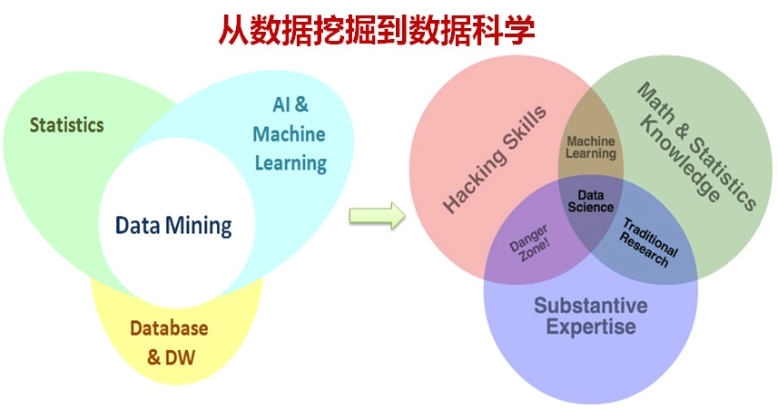
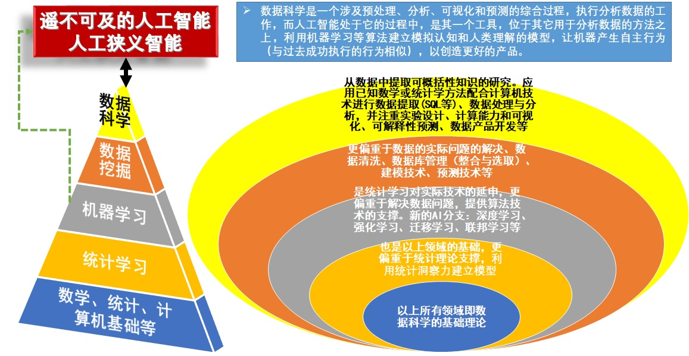

# 概率图模型(Probabilistic Graphical Models, PGMs)

- 概率图模型结合了概率论与图论的知识

- 提供了一种简单的可视化概率模型的方法

- 学习使用PGMs，理解计算机如何通过贝叶斯模型和马尔可夫模型来解决真实世界的问题

- 选择合适的R包和算法处理数据并建模，属于数据科学范畴

- 

# 前  言

- PGMs是统计机器学习领域表示现实世界带有概率信息的数据和模型的最先进技术之一

- 使用贝叶斯方法来描述算法：概率和贝叶斯公式的基本原理

- 目的：从带有噪音和不确定性的真实世界中得出结论

- 推断和学习算法：自动从数据中构建模型（结构学习和参数参数）

- 关注解决数据科学问题的方法：贝叶斯分类模型、混合模型、贝叶斯线性回归以及用于构建复杂模型的基本模型（它们都可被PGMs表示在一个大框架下）

# 前  言

## 主要内容

- 第1章 概率推理：概率论和PGMs的基本概念及建模方法

- 第2章 精确推断：通过简单图形组合和模型查询（联结树精确推断算法）构建PGMs

- 第3章 学习参数：从数据集中使用最大似然法拟合和学习PGMs参数

- 第4章 贝叶斯建模：贝叶斯模型可作为更加复杂模型的基础模型、自适应算法拟合和查询贝叶斯模型

- 第5章 近似推断：PGMs的第二种推断方法，采样算法如MCMC（马尔科夫链蒙特卡洛）

- 第6章 贝叶斯建模：线性模型

- 第7章 概率混合模型：复杂的概率模型

- 网址：<http://www.packtpub.com>，注册登录后，再访问 <http://www.packtpub.com/support>，进行Code Downloads

# 第1章 概率推理

-  20世纪90年代中后期兴起数据挖掘，每天都在产生海量的数据 
    
-  连锁超市Wal-Mart数据库已累积10TB(1TB = 1000GB = $2^{40}$B = `r 2^40`B)级以上顾客购买行为和销售数据   
    
-  Google每天处理高达24PB(1PB = 1000TB = $2^{50}$B = `r 2^50`B), Twitter信息量的日发微博量达几亿条   
    
-  人类积累了大约超过500EB(1EB = 1000PB = $2^{60}$B = `r 2^60`B)以上的数据，大约500X10亿部压缩数字电影   
  
-  全世界数据量将达到3ZB(1ZB = 1000EB = $2^{70}$B = `r 2^70`B)以上，若全刻录在光盘，则光盘罗列高度是地球到月球距离5倍多

# 第1章 概率推理（续）

- 信息和大数据时代来临，存储数据不是获取知识，我们需要“挖矿”

  - 
  
  - 统计学习（机器学习）或统计机器学习就是把数据转化为知识的最先进的技术之一，它是理解并挖掘数据的一个巨大的工具集

  - 统计学习（机器学习）方法应用于大数据的分析就称为“数据挖掘”。(Alpaydin, E., 2009. Introduction to Machine Learning, Adaptive Computation and Machine Learning Series, seconded. The MIT Press,Cambridge, MA, USA.)
  
    > 通过数据挖掘应用，可从现有数据信息中检索、探索，同时从给定的数据信息库中去推断、预测并获得新的隐藏在数据背后的信息

# 第1章 概率推理（续）

- 21世纪最性感职业：数据科学家——采用科学方法、运用数据挖掘工具寻找新的数据洞察的工程师（更加全面的人才）

  - 
  
# 第1章 概率推理（续）

- 数学、统计学、计算机基础等，统计学习，机器学习，数据挖掘，数据科学与人工智能的关系

  - 
  
