# 概率图模型(Probabilistic Graphical Models, PGMs)

- 概率图模型结合了概率论与图论的知识

- 提供了一种简单的可视化概率模型的方法

- 学习使用PGMs，理解计算机如何通过贝叶斯模型和马尔可夫模型来解决真实世界的问题

- 选择合适的R包和算法处理数据并建模，属于数据科学范畴

- 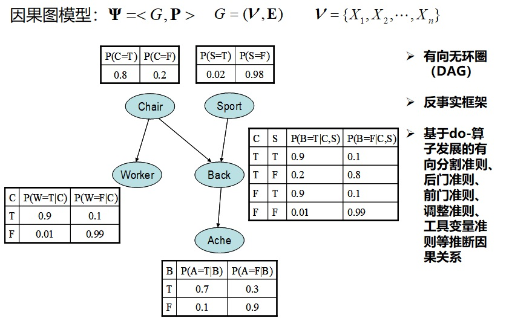

# 前  言

- PGMs是统计机器学习领域表示现实世界带有概率信息的数据和模型的最先进技术之一

- 使用贝叶斯方法来描述算法：概率和贝叶斯公式的基本原理

- 目的：从带有噪音和不确定性的真实世界中得出结论

- 推断和学习算法：自动从数据中构建模型（结构学习和参数参数）

- 关注解决数据科学问题的方法：贝叶斯分类模型、混合模型、贝叶斯线性回归以及用于构建复杂模型的基本模型（它们都可被PGMs表示在一个大框架下）

# 前  言

## 主要内容

- 第1章 概率推理：概率论和PGMs的基本概念及建模方法

- 第2章 精确推断：通过简单图形组合和模型查询（联结树精确推断算法）构建PGMs

- 第3章 学习参数：从数据集中使用最大似然法拟合和学习PGMs参数

- 第4章 贝叶斯建模：贝叶斯模型可作为更加复杂模型的基础模型、自适应算法拟合和查询贝叶斯模型

- 第5章 近似推断：PGMs的第二种推断方法，采样算法如MCMC（马尔科夫链蒙特卡洛）

- 第6章 贝叶斯建模：线性模型

- 第7章 概率混合模型：复杂的概率模型

- 网址：<http://www.packtpub.com>，注册登录后，再访问 <http://www.packtpub.com/support>，进行Code Downloads

# 第1章 概率推理

-  20世纪90年代中后期兴起数据挖掘，每天都在产生海量的数据 
    
-  连锁超市Wal-Mart数据库已累积10TB(1TB = 1000GB = $2^{40}$B = `r 2^40`B)级以上顾客购买行为和销售数据   
    
-  Google每天处理高达24PB(1PB = 1000TB = $2^{50}$B = `r 2^50`B), Twitter信息量的日发微博量达几亿条   
    
-  人类积累了大约超过500EB(1EB = 1000PB = $2^{60}$B = `r 2^60`B)以上的数据，大约500X10亿部压缩数字电影   
  
-  全世界数据量将达到3ZB(1ZB = 1000EB = $2^{70}$B = `r 2^70`B)以上，若全刻录在光盘，则光盘罗列高度是地球到月球距离5倍多

# 第1章 概率推理（续）

- 信息和大数据时代来临，存储数据不是获取知识，我们需要“挖矿”

  - 
  
  - 把数据转化为知识的最先进的技术之一：统计学习（机器学习）或统计机器学习

  - 统计学习（机器学习）方法应用于大数据的分析就称为“数据挖掘”。(Alpaydin, E., 2009. Introduction to Machine Learning, Adaptive Computation and Machine Learning Series, seconded. The MIT Press,Cambridge, MA, USA.)    
  
    > 通过数据挖掘应用，可从现有数据信息中检索、探索，同时从给定的数据信息库中去推断、预测并获得新的隐藏在数据背后的信息
  
    > 21世纪最性感职业：数据科学家——采用科学方法、运用数据挖掘工具寻找新的数据洞察的工程师

# 第1章 概率推理（续）

- 数学、统计学、计算机基础等，统计学习，机器学习，数据挖掘，数据科学与人工智能的关系
  
# 统计学习介绍

  - 19世纪初：最小二乘法(Legendre,Gauss)；1936年：线性判别分析(Fisher)；20世纪40年代：Logistic回归(多个作者)；20世纪70年代初期：广义线性模型(Nelder,Wedderburn)；20世纪70年代末期：大量从数据中学习的技术出现，几乎全是线性方法，非线性关系的拟合在那个年代计算不可行；20世纪80年代：随着计算技术的发展，非线性方法得到很大发展；20世纪80年代中期：分类与回归树(Breiman,Friedman,Olshen,Stone)，包括交叉验证和模型选择；1986年：广义可加模型(Hastie,Tibshirani)；至此，机器学习和统计学习等术语就开始出现了
  
  - 统计学习就是指理解并挖掘数据的一个巨大的工具集
  
  - 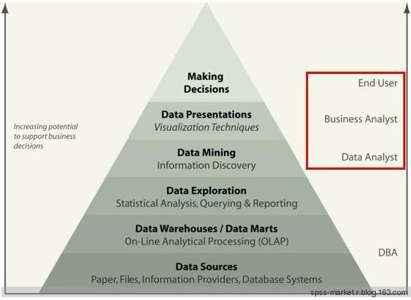
  
  - 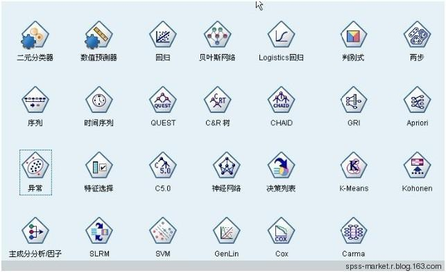

## 通过统计学习我们能做什么样的数据挖掘应用？

  - 根据公司绩效评估或业绩考核以及相关经济数据可以预测某一股票从现在开始在未来6个月内的市场价格   
  
  - 从人体血液的红外吸收光谱数据中估计糖尿病人群血液葡萄糖含量
    
  - 预测一位因心脏病住院的患者是否将发生第2次心脏病，我们可以通过收集这些患者的人口学特征，饮食习惯和临床体征测量等数据来达到预测的目的  
  
  - 从临床及人口学特征中识别导致前列腺癌的风险因素或通过生物信息学对疾病基因的微阵列样本分类并识别关键风险基因
  
  - 从目前大量潜在客户的人口学信息中去聚类相同特征的客户
  
  - 从64粒癌症细胞株的每粒细胞的6830个基因表达测量水平中去识别相同类型的癌症  
  
    - 
    
## 什么是统计学习

  - 为什么需要估计$f(x)$   

  - 如何去估计$f(x)$   

  - 预测精度与模型可解释性之间的权衡   

  - 有监督学习 VS 无监督学习

  - 回归问题 VS 分类问题

## 什么是统计学习

  - 广告数据：200家超市的某个特定产品的销售数据

  - 输入变量（预测变量、自变量、特征变量）：广告预算   $X$，  $X_1$-电视广告预算，$X_2$-电台广告预算，$X_3$-报纸广告预算   
  
  - 输出变量（响应变量、因变量）：产品销售额  $Y$
  
    - 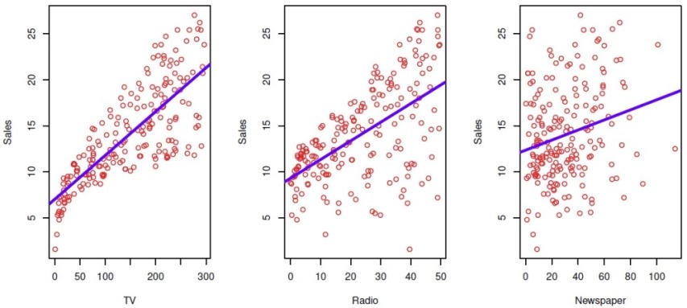
    
## 什么是统计学习（继续）

  - 假设观察到 *$Y_i$* 和 *$X_i=(X_{i1},...,X_{ip})$* , *$i=1,2,...,n$*

  - 我们认为 $Y$ 与 $X$ 中至少一个变量存在关系

  - 我们能够构建模型如下：$$ Y_i = f(X_i) + ε_i $$

  - 此处$f$是一个未知函数，$ε$是一个均值为0的随机误差项

## 一个简单实例

  - 假设下图表示变量 $X$ 能够预测 $Y$，然而链接它们关系的 $f$ 通常未知
  
  - 基于观察到的数据点去估计 $f$，垂直线表示误差项 $ε$
  
  -  有些点在拟合线条之上，有些点在拟合线条之下，总体来看，误差项有近似0均值

  - 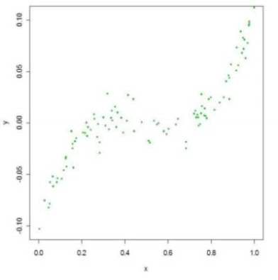
    
  - 

## 不同标准差(Standard Deviations)

  - 估计 $f$ 的难度将依赖于 $ε$ 的标准差   
  
  - 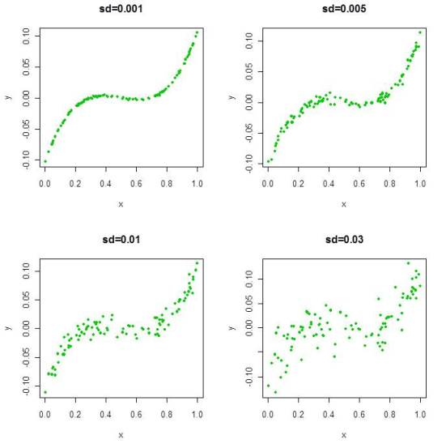

## 对 $f$ 的不同估计

  - 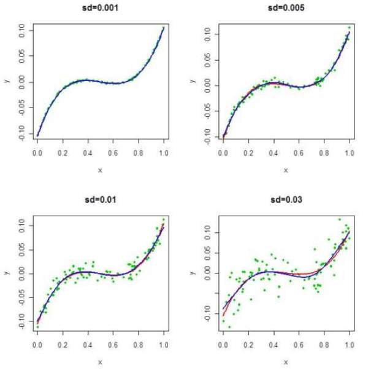

## 收入 VS 受教育年限 工龄 

  - 工资数据（涉及2个输入变量）
  
    > 考虑大西洋地区的美国男性工人"工资"与"年龄"、"受教育年限"、"工龄"等因素的关系（$f$ 被估计展示二维曲面）   
    > 本章将概括在估计 $f$ 的过程中出现的一些关键理论概念以及评价 $f$ 估计好坏的统计工具 

  - 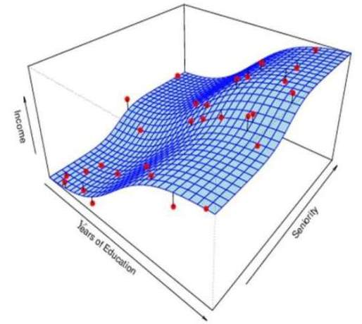
  
## 问题1：我们为什么要估计 $f$ ?   

  - 本课程就是所有关于如何去估计 $f$ 的统计学习方法
  
  - 统计学习就是指用数据去“学习”  $f$
  
  - 为什么关注 $f$ 的估计？  
  
  - 主要有两个原因：   

    * 预测   
    
    * 推断
    
## 预测

  - 如果我们能够生成一个对 $f$ 很好的估计（$ε$的方差不是很大），那么基于自变量 $X$ 的一个新值，我们就可以对响应变量 $Y$ 做出精确的预测。 $$\hat{Y}=\hat{f}(X)$$
  
  - 实例：患者的血液样本数据去预测他对某种特定药物产生严重不良反应的风险
  
  - $\hat{Y}$ 的精确度依赖两个量："可约误差项"和"不可约误差项"
  
    - 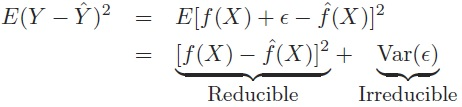
    
    - 统计学习技术的目的就是估计 $f$ 使得可约误差项最小化

## 推断

  - 另一个我们关心的就是 $Y$ 与 $X$ 之间的关系类型
  
  - 例如：   
  
    * 哪个特定的预测变量 $X_p$ 实际上影响了响应变量 $Y$ ?   
    
    * $Y$ 与 $X$ 之间是一种正相关还是负相关？   
    
    * $Y$ 与 $X$ 的关系是线性的、非线性的、还是更复杂的关系？     
  
  - 实例：房产价格推断
  
    * 基于14个预测变量，希望预测中位房价   
    
    * 可能想了解哪个预测变量是最影响房价的且它产生影响的大小   
    
    * 例如处在河景位置的房产对房价的影响大小   
    
## 如何去估计 $f$ ？

  - 假定我们已经观察到一组训练数据(training data) $${(X_1,Y_1),(X_2,Y_2),...,(X_n,Y_n)}$$
  
  - 我们必须利用训练数据和一个统计学习方法去估计 $f$， 即对任意观察值 $(X,Y)$，有 $$Y≈\hat{f}(X)$$
  
  - 统计学习方法   
  
    * 参数方法(Parametric Methods)   
    
    * 非参数方法(Non-parametric Methods)
    
## 参数方法  

  - 它们把估计 $f$ 的问题归纳成估计一组参数值的问题
  
  - 参数方法涉及“基于两步模型的方法”
  
    * 第 1 步：    
   ------------   
      
        对 $f$ 的函数形式作一个假设，比如，提出一个模型。最常见的例子是线性模型 $$f(X_i)=\beta_0+\beta_1X_{i1}+\beta_2X_{i2}+\cdots+\beta_pX_{ip}$$  
        
        $f$ 被假定是线性的，则估计 $f$ 的问题就被极大的简化了
        
        
## 参数方法（继续）  
    
  * 第 2 步：    
 ------------   
      
    选定一个模型之后，用训练数据去拟合模型，比如，估计 $f$ 就等于去估计未知参数 $\beta_0,\beta_1,\beta_2,\cdots,\beta_p$。
    
      - 估计线性模型中参数的最常见的方法就是最小二乘法(ordinary least squares (OLS))
      
      - 然而，这仅仅是一种方法
      
      - 我们将在本课程中学习到其它优越的方法  
      
  * 参数方法的缺点：我们选择的模型通常不能很好的匹配 $f$ 真是未知的函数形式   
  
  * 然而，本课程内容将对更加复杂灵活的模型中的 $f$ 进行估计。从某种意义上来说，模型越灵活则它越逼真（接近真实的数据形状）。
      
## 实例：收入 VS 受教育年限 工龄 三者关系的线性回归估计 

  - 即使 $ε$ 的标准差很小，但如果我们用错了模型也将得到错误的回答   
  
  - $$Income=\beta_0+\beta_1*Education+\beta_2* Seniority$$   
  
    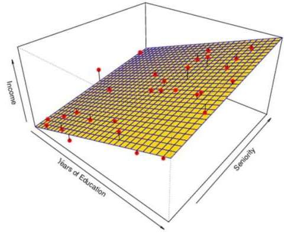
    
        
## 非参数方法

  - 它们对 $f$ 的函数形式不作明确的假设，尽可能的寻找一个没有太多波动且接近数据点的对 $f$ 的估计 
  
  - 优势：准确的拟合更大可能范围的 $f$ 形状
  
  - 缺点：为获得对 $f$ 的精确估计，需要更大量的观察数据（远远超出参数方法所需的样本量）
  
## 实例：薄板样条曲线估计

  - 非线性回归方法更加灵活，且可以提供更加准确的估计 
  
  - 估计的 $f$ 完美的拟合了观察数据，但有一个很低的光滑度，且它比真实的 $f$ 有更大的波动性，我们称之"过度拟合"，图中的红点表示观察值 
  
    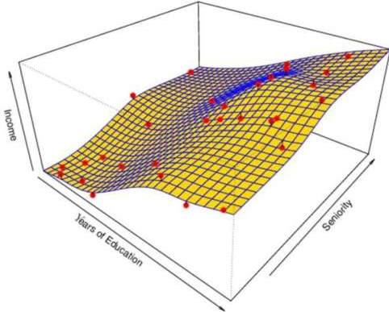
    
  
## 预测精度与模型可解释性之间的权衡

  - 有些方法不太灵活且限制性太多，估计 $f$ 没有太多形式的选择，但却具有很好的解释性；而有些方法虽非常灵活且估计 $f$ 的形式有很多可能的选择，但解释起来很难
  
  - 如果模型更接近现实数据情况，为什么我们宁愿选择使用更多限制性的方法，而不使用更加灵活的方法呢？
  
  - 有两个主要原因
  
  * 原因1：如果关注推断，限制性强的模型更具解释性，但精确性不具有很好的保证    
 ------------------------------------------------------------------------------------------------------   
 
    > 譬如简单的线性回归方法产生的模型很容易解释参数意义（参数推断部分的理论也很完备）。例如，在一个线性模型中，$\beta_j$ 表示控制所有其它预测变量不变的条件下每增加 $X_j$ 一个单位导致 $Y$ 平均量的增加 
    
## 预测精度与模型可解释性之间的权衡（继续）
    
  * 原因2：如果关注预测，灵活性强的模型更具精确性，但解释性几乎没有   
 -----------------------------------------------------------------------------------------------
 
    * 样条曲线、SVM、bagging和boosting算法等在估计 $f$ 时非常灵活，但很难理解每个预测变量与响应变量之间关系
    
    * 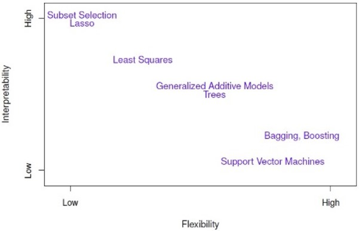    
        
## 一个差的估计

  - 即使你仅仅对预测感兴趣，有时用一个简单非复杂的模型就可能获得更加精确的预测。这似乎是反直觉的，但又不得不面对更加灵活的模型可能过度拟合数据的潜在事实。因此，非参数方法也可能产生对 $f$ 的一个很差的估计   
  - 图中的红点表示观察值，估计的 $\hat{f}$ 对应的曲面穿过所有的观察点
  
    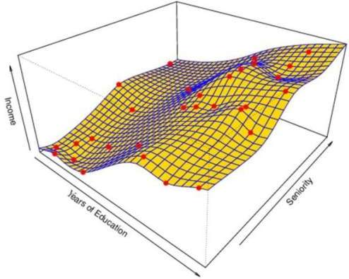
    
    
## 有监督学习 VS 无监督学习

  - 我们把所有的学习问题可以大致划分为**有监督学习**和**无监督学习**两种    
  
  - 有监督学习
  
    * 有监督学习是指预测变量 $X_i$ 和 响应变量 $Y_i$ 都被观察到   
    
    * 在线性回归问题中就是有监督学习的一种情况   
    
    * 本课程将主要处理有监督学习的问题
    
## 有监督学习 VS 无监督学习（继续）

  - 无监督学习   
  
    * 这种情况只有自变量 $X_i$ 被观察到   
    
    * 我们需要利用 $X_i$ 去猜测  $Y$ 可能的状态，并根据  $X_i$ 去构建预测可能  $Y$ 的模型   
    
    * 一个常见的例子就是市场划分，我们试着根据客户的特征数据把潜在的客户划分到不同的市场组别中去
    
    * 最常见的方法就是聚类分析   
    
    * 本课程最后部分将考虑无监督学习的内容
    
    * 半监督问题！！
    
##  简单的聚类实例  

  - 现有变量 $X_1$和$X_2$ 的150个观察值，需确定每个观察值属于哪个组或类

  - 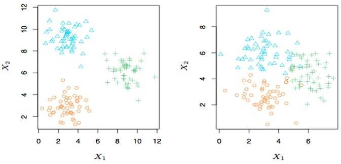
    
## 回归 VS 分类问题

  - 有监督学习问题能够被进一步划分成回归和分类问题   
  
  - 回归问题覆盖了 $Y$ 是连续/数值变量的情况，比如
  
    * 预测未来6个月内的道琼指数值   
    
    * 基于多个影响变量，预测房产价格
    
  - 分类问题覆盖了 $Y$ 是分类/定性或属性变量的情况，比如

    * 第6个月的道琼指数是上涨(U)或是下跌(D)
  
    * 某封邮件是(1)否(0)为垃圾邮件
  
## 不同的方法

  - 本课程主要处理上述的回归与分类的问题，但在选择统计学习方法的时候，倾向于根据响应变量的类型来考虑
  
  - 有些方法即可处理定性响应变量，也可处理定量响应变量，比如，K-近邻算法、boosting算法
  
  - 其它有些方法在回归问题上处理的很好，例如线性回归，而有些方法在分类问题上处理的很好，比如K-近邻算法

## 作业

  - 先行了解R，了解R的基本命令
  
  - 预习第2章内容