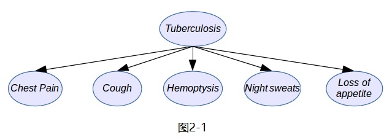
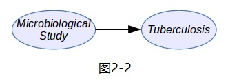
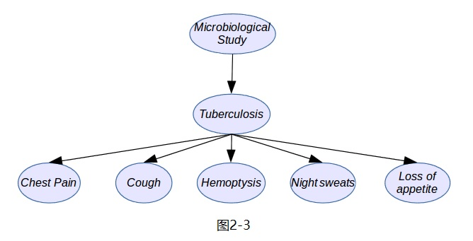
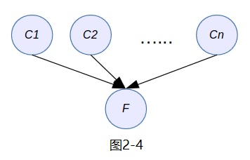
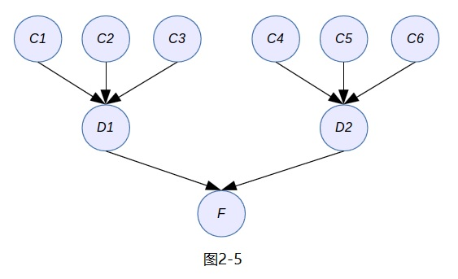
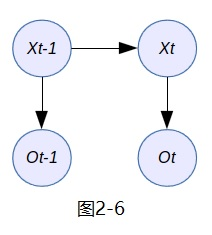
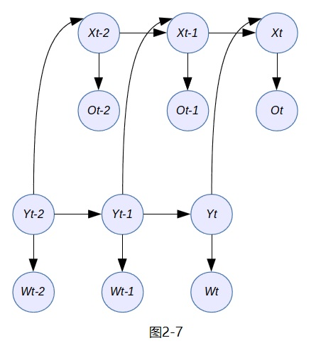

# 第2章 精确推断

- 通过使用PGMs模型和对变量子集的观察来查询分布的算法，目的是为了发现另一个变量子集上的后验概率

- 没有必要观察和查询所有的变量，但研究的所有算法可用在任何被观察的子集或被查询的子集上

- 主要有两种类型的查询

  * 
    + __概率查询__：观察到随机变量子集$E$，取值为$e$（即一个实例），称之为证据；可计算另一个随机变量子集$Y$的后验概率分布$P(Y|E=e)$
  
  * 
    + __最大后验概率(MAP)查询__：也称为**最可能解释(MPE)查询**，即给定证据$E=e$的条件下，对变量子集$Z$找出拥有最大概率的联合赋值；MAP联合赋值定义为$$MAP(Z|E=e)=argmax_zP(z,e)$$
  
- 本章目的：介绍解决精确推断问题即上述查询问题的主流算法；而推断问题可化解为通过贝叶斯规则找出后验概率的问题

- 设定$\chi$为模型中所有随机变量的集合，$E$是被观察到的变量子集（证据），$Z$是隐含变量或未被观察到的变量子集，那么计算概率图模型的推断如下：$$P(Z|E,\theta)=\frac{P(Z,E|\theta)}{P(E|\theta)}=\frac{P(Z,E|\theta)}{\sum_{z \in Z}P(Z=z,E|\theta)}$$

- 例如，医学问题中，给定观察到的症状集合，推断所有可能的疾病；语音识别系统中，推断被记录的声音（即说话者的语音）中最可能的单词序列；雷达跟踪系统中，从雷达读数中推断跟踪物体位置的概率分布；推荐系统中，给定售卖网站上用户最近的点击数据后，推断待售产品的后验概率分布，以便给客户提供最优的$5$个产品的排序和推荐

- 所有这些问题以及更多问题都需要计算后验概率分布，介绍概率图模型(PGMs)下基础算法和高效算法：变量消解算法、和积算法、联结树算法，目前都可在R程序包中实现，例如**gRain**、**gR**和**rHugin**程序包中的函数

# 2.1 构建图模型 

- 确定图模型中涉及的变量：可以观察到或度量到的事实，也表示一个或真或假（或是或否）的简单事实

  * 
    + 变量可捕捉与问题相关的局部内容，而却无法直接度量或估计这些与问题相关的变量；例如，外科医生可度量病人的一系列症状，但疾病并不是可直接观察到的事实，且只能通过几个症状的观察结果推断出来

  * 
    + 直接推出病人得了感冒不太符合事实，除非医生$\Longrightarrow_{鼻黏液采样}^{鼻病毒数量}$上呼吸道（鼻子）病毒感染）；或者，从简单的症状例如头痛、流鼻涕等推断结论；此时，严格说**病人感冒变量**不是被直接观察到的

- 确定图模型中的图结构：不同变量之间的直接或间接的依赖（关联或交互）关系，即统计上的相关性

# 2.1.1 随机变量的类型

- 许多科学领域使用离散型变量进行建模非常常见，其构建的图模型背后的数学逻辑易于理解和实现

- 设一个离散随机变量$X$定义在有限样本空间$S={\nu_1, \nu_2, \cdots, \nu_n}$上

  * 
    + 一个骰子定义的样本空间为$S=\left\{1, 2, 3, 4, 5, 6\right\}$
  
  * 
    + 一枚硬币定义的样本空间为$S=\left\{H, T\right\}$
  
  * 
    + 一个症状定义的样本空间为$S=\left\{true, false\right\}$
  
  * 
    + 单词中的一个字母定义的样本空间为字母集合$S=\left\{a, b, c, d, e, \cdots, z\right\}$
  
  * 
    + 大量英文单词中一个单词的样本空间为单词集合$S=\left\{the, at, in, bread, \cdots, computer, \cdots \right\}$，这个集合会很大，但也是有限的
  
  * 
    + 字号尺寸大小定义的样本空间为数值集合$S=\left\{0, 1, 2, 3, \cdots, 1000\right\}$pt
  
- 设一个连续随机变量是定义在一个连续的样本空间$\mathbb{R}$，$\mathbb{C}$或任意区间或多维空间$\mathbb{R}^n$上，有时把维度分成$n$个不同的定义在$\mathbb{R}$上的随机变量也是有意义的

  * 
    + 距离公里数、温度、价格、随机变量的平均值或方差等
  
  * 
    + 考虑贝叶斯方法时，所有的数值都可看作随机变量的取值，因此如果定义一个服从正态分布$N(\mu, \sigma^2)$的随机变量，也可进一步把$\mu$，$\sigma^2$理解为随机变量；图模型中把许多参数当成随机变量并在图中连接起来通常是很有用的

# 2.1.2 构建图结构

- 图结构即变量之间的连接是基于常识、因果交互或其它存在于变量间足够强的依赖关系而获得的，当然也可通过算法自动从数据集中学习这些连接（文献中的关键词：因果关系(causality)、稀疏模型(sparse models)、因式分解(factorization)）

- 当两个变量连接时，模型和信息流会发生什么变化？重要概念：$d$-分离

- 另一种生成图模型的方法是模块化，即通过简单的模块构建复杂的图模型且可通过扩展图结构来扩展现有模型

- **参数学习和查询问题都归结为学习和推断算法的应用**

# 2.1.2 构建图结构
## 概率专家系统

- 肺结核医疗诊断：肺结核是由结核杆菌引起的，只有临床生物分析检验可检测出这种病毒且确认是否为肺结核；然而，物理检验也可揭示一些肺结核的线索，协助外科医生推断是否需要全面的临床检验以得出病人体内是否存在病毒的判断；完整的肺结核医疗评估必须包含医疗历史、物理检验、胸部透视以及微生物检验<http://en.wikipedia.org/wiki/Tuberculosis_diagnosis>

- **确定模型（系统）中用到的随机变量**：

  * 
    + $Cough(C)$：超过$3$周的咳嗽，取值**是或否**；
  
  * 
    + $Chest Pain(P)$：胸脯疼痛，取值**是或否**；
  
  * 
    + $Hemoptysis(H)$：咯血，取值**是或否**；
  
  * 
    + $Night Sweats(N)$：盗汗，取值**是或否**；
  
  * 
    + $Loss of appetite(L)$：食欲不振，取值$3$个等级$\left\{low, medium, strong\right\}$，中医症状比较主观，表示饭量减少的程度
  
  * 
    + 由于只有微生物研究(microbiological study)可能确定是否肺结核，而其它的症状或变量只能反向推断肺结核的存在，故还需定义两个随机变量：是否发现病毒$M$（两个概率值）；是否患有肺结核或是否肺结核呈阴性$tuberculosis(T)$（四个概率值）

- **确定图结构并学习参数**：连接随机变量的图形，估计每个变量相互连接的先验概率或者图中每个节点的参数
  
  * 
    + 从二元症状$C, P, H, N$和$L$开始，它们都由疾病$T$引起的，如下图$2-1$：
    
      
  * 
    + 在上面的图模型中处理原因和结果的模式是很常见的，可把同样的思路用到微生物研究$M$和疾病$T$的关系中，如图$2-2$所示：
    
      
      
  * 
    + 把两个子模型的图结构即图$2-1$和图$2-2$组合成更加复杂的图模型，其图结构如图$2-3$：

      
      
  * 
    + 事实上，可以在同一个图中添加更多症状和疾病，以便可以区分诸如肺结核和肺炎以及其它包含类似症状的疾病；通过计算给定症状下每个疾病的后验概率，辅助医生判断采取什么医疗方案来应对最可能的疾病；这种形式的概率图模型有时也称为**概率专家系统**

# 2.1.2 构建图结构
## 概率图模型的基本结构

- 同一个事实有很多原因的图结构，如下图$2-4$：假设原因$C_1,C_2,\cdots,C_n$都是二元变量，以及事实$F$也是二元变量，对应的概率分布是$P(F|C_1,C_2,\cdots,C_n)$，它可用一个带有$2^{n+1}$个值的表确定；如果$n=10$，这个值并不大，只需要`r 2^(10+1)`个值，但如果$n=20$，则需要`r 2^(20+1)`个值，占用了很大内存；如果变量取值$k$，那就需要$k^(n+1)$个值，那就更加庞大了

  

  *
    + 其实有些原因并没有直接与事实关联，而是导致其它原因的原因，在这种情况下，可考虑给出原因的层级图结构，如下图$2-5$中处理了$8$个原因，但每个局部条件概率，例如$P(D_1|C_1,C_2,C_3)$最多只涉及$4$个变量，就变得容易处理了
    
      

- 考虑时间上变量序列的图结构：这种结构不会捕捉因果关系而是捕捉变量在时间上的顺序，假设随机变量$X_t$表示模型$X$在时间$t$的状态，并假设模型$X$的当前状态可以预测下一刻的状态，因此，给定前一时刻状态$X_{t-1}$时，模型$X$当前状态的概率分布为$P(X_t|X_{t-1})$，其中$t$和$t-1$表示时间；另外，再假设另一个随机变量$O_t$在时间$t$的观察结果直接依赖于$X_t$的状态（但不属于模型$X$），则确定$P(O_t|X_t)$是合理的，如下图$2-6$

  
  
  *
    + 当随机变量$X_t$和$O_t$是离散型的，则此概率图模型也叫作**隐马尔可夫模型(Hidden Markov Model)**或**马尔可夫模型(Markov Model)**；它的当前状态只依赖于之前的状态，即$X_t$只依赖于$X_{t-1}$
    
  *
    + 当随机变量$X_t$和$O_t$服从正态分布（高斯分布），则此概率图模型就是著名的**卡尔曼滤波器(Kalman filter)**，一种最优化自回归数据处理算法
    
- 结合了两个隐马尔可夫模型的图结构：其中一个模型$Y$也是另一个模型$X$的原因，如下图$2-7$

  

  *
    + 这个概率图模型的联合概率分布可分解成$$P(\chi = \left\{X,O,Y,W\right\})=P(Y_{t-2})\cdot P(W_{t-2}|Y_{t-2})\cdot P(Y_{t-1}|Y_{t-2})\cdot P(W_{t-1}|Y_{t-1})\cdot P(Y_t|Y_{t-1})\cdot P(W_t|Y_t)$$  $$P(X_{t-2}|Y_{t-2})\cdot P(O_{t-2}|X_{t-2})\cdot P(X_{t-1}|Y_{t-1},X_{t-2})\cdot P(O_{t-1}|X_{t-1})\cdot P(X_t|Y_t,X_{t-1})\cdot P(O_{t-1}|X_{t-1})$$
    
# 2.2 变量消除法

- 正如前面的模型示例所见，当人们处理推断问题时，需要面对一个NP-难题即导致参数估计算法有指数级的时间复杂度

- 推断是指给定模型中变量子集的观察值后，计算其它变量子集的后验概率；这两个子集通常可选取任一不相交的子集

- 设$\chi$为图模型中所有变量的集合，$Y,E\subset \chi$是两个不相交的变量子集；$Y$为查询子集，$E$为观察到的证据（观测子集），需计算$P(Y|E=e)$

